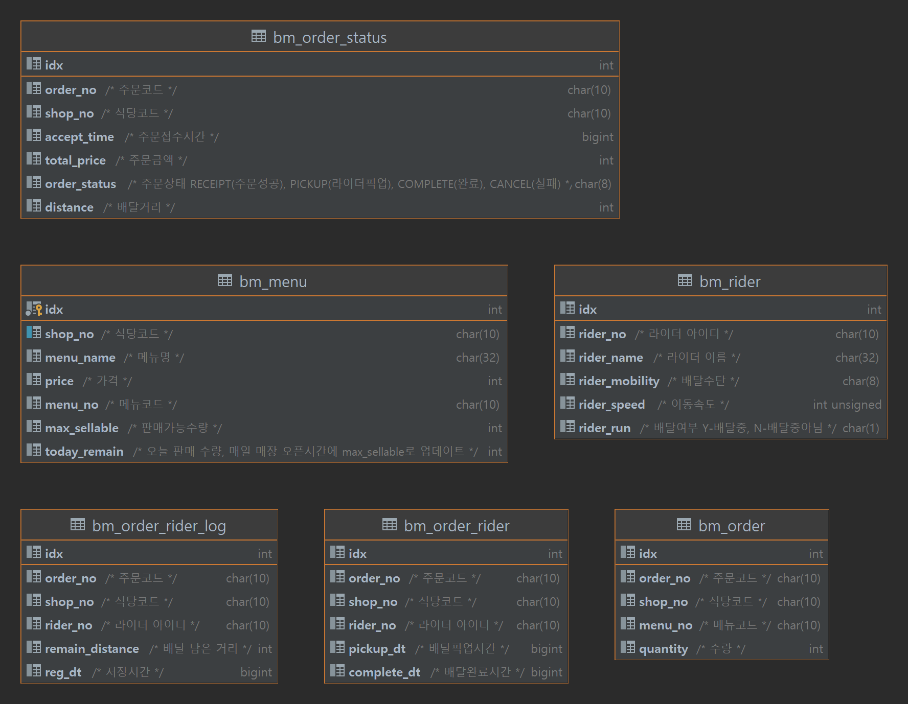

# 프로세스 설명
## 주문 시스템 프로세스
###	주문 접수 (/order)
1. 주문 확인 (init)
2. 주문 내역 저장 
   * DB Table : bm_order
3. 주문 판매 수량 업데이트 
   * DB Table : bm_menu
     * Field : today_remain
4. 주문 상태 저장 
   * DB Table : bm_order_state
     * Field : order_state => RECEIPT
5. 라이더 시스템 호출 (/rider)
### 주문 상태 업데이트 (/orderStateUpdate)
1. 주문 상태 업데이트
   * DB Table : bm_order_state
     * Field : order_state => PICKUP
2. 주문 배달 로그 저장 
   * DB Table : bm_order_rider_log
### 주문조회 (/orderCheck)
* 주문 상태 조회 
  * 배달완료에서는 남은 거리가 표시되지 않음.
  * ex) 배달중
    ```
    {
        "remainDistance":500,
        "orderNo":"ORD_A01",
        "totalPrice":22000,
        "state":"PICKUP",
        "menus":[
            {
                "quantity":1,
                "price":6000,
                "menuName":"짜장면"
            },
            {
                "quantity":2,
                "price":16000,
                "menuName":"볶음밥"
            }
        ],
        "shopNO":"SHOP_01"
    }
    ```
  * ex) 배달완료 :
    ```
    {
        "orderNo":"ORD_A01",
        "totalPrice":22000,
        "state":"COMPLETE",
        "menus":[
            {
                "quantity":1,
                "price":6000,
                "menuName":"짜장면"
            },
            {
                "quantity":2,
                "price":16000,
                "menuName":"볶음밥"
            }
        ],
        "shopNO":"SHOP_01"
    }
    ```
  * ex) 배달전 :
    ```
    {
        "orderNo":"ORD_A01",
        "totalPrice":22000,
        "state":"RECEIPT",
        "menus":[
            {
                "quantity":1,
                "price":6000,
                "menuName":"짜장면"
            },
            {
                "quantity":2,
                "price":16000,
                "menuName":"볶음밥"
            }
        ],
        "shopNO":"SHOP_01"
    }
    ```
  * ex) 잘못된 주문번호 :
    ```
    {
        "orderNo":"ORD_A07",
        "state":"Incorrect order number"
    }
    ```

## 라이더 시스템
### 라이더 배정 (/rider)
1. 라이더 확인(init)
2. 라이더 배정 
   * DB Table : bm_order_rider
3. 상점 시스템 호출 (/orderStateUpdate)
4. 상점 시스템 호출이 성공하면 라이더 상태 업데이트
   * DB Table : bm_rider
     * Field : rider_run => Y
### 배달조회 (/riderCheck)
* 배달 상태 조회
  * 배달완료에서는 기대시간이 표시되지 않음
  * ex) 배달중 :
    ```
      {
          "expectedArrival":"30sec",
          "orderNo":"ORD_A04",
          "riderMobility":"자전거",
          "shopNo":"SHOP_01",
          "riderName":"고길동",
          "status":"PICKUP"
      }
    ```
  * ex) 배달완료 :
    ```
      {
          "orderNo":"ORD_A04",
          "riderMobility":"자전거",
          "shopNo":"SHOP_01",
          "riderName":"고길동",
          "status":"COMPLETE"
      }
    ```
  * ex) 배달전 :
     ```
        {
            "orderNo":"ORD_A06",
            "shopNo":"SHOP_01",
            "status":"RECEIPT"
        }
    ```
  * ex) 잘못된 주문번호 :
    ```
      {
          "orderNo":"ORD_A07",
          "status":"Incorrect order number"
      }
    ```

## 스케줄러
* 배달 로그 스케줄러 (10초 단위로 수행)
  * 상점 시스템 호출 (/orderLog)
    * 픽업된 주문을 검색
    * 라이드 스피드 고려하여 남은 거리를 확인
      * 남은 거리가 0인 경우 배달완료 처리
        * DB Table : bm_order_state
          * Field : order_state => COMPLETE
        * DB Table : bm_order_rider
          * Field : complete_dt => 배달완료시간
        * DB Table : bm_rider
          * Field : rider_run => N
        * 접수된 주문 확인         
        * 라이더 시스템 호출 (/rider)
      * 아직 배달되지 않은 경우 남은 거리업데이트 
        * DB Table : bm_order_rider_log
          * Field : remain_distance => 남은거리

## 주문 취소 조건
* 단일 메뉴 주문 개수가 5개를 초과하는 경우
* 메뉴별 판매가능 수량보다 많이 주문한 경우
* 한 주문에서 동일한 메뉴를 주문한 경우
* 주문거리가 200~600사이가 아닌 경우

## 배달 로그
* 로그는 logger.info로 출력되며 다음 형태로 출력된다.
```
INFO  2022-04-03 21:17:25[http-nio-127.0.0.1-8080-exec-4] [ShopService.java - updateOrderLog] [ShopService:190] - [RIDER_A02][고길동][ORD_A01][250]
INFO  2022-04-03 21:17:25[http-nio-127.0.0.1-8080-exec-4] [ShopService.java - updateOrderLog] [ShopService:190] - [RIDER_A01][임꺽정][ORD_A02][300]
INFO  2022-04-03 21:17:35[http-nio-127.0.0.1-8080-exec-2] [ShopService.java - updateOrderLog] [ShopService:190] - [RIDER_A02][고길동][ORD_A01][200]
INFO  2022-04-03 21:17:35[http-nio-127.0.0.1-8080-exec-2] [ShopService.java - updateOrderLog] [ShopService:190] - [RIDER_A01][임꺽정][ORD_A02][200]
INFO  2022-04-03 21:17:45[http-nio-127.0.0.1-8080-exec-3] [ShopService.java - updateOrderLog] [ShopService:190] - [RIDER_A02][고길동][ORD_A01][150]
INFO  2022-04-03 21:17:45[http-nio-127.0.0.1-8080-exec-3] [ShopService.java - updateOrderLog] [ShopService:190] - [RIDER_A01][임꺽정][ORD_A02][100]
INFO  2022-04-03 21:17:55[http-nio-127.0.0.1-8080-exec-5] [ShopService.java - updateOrderLog] [ShopService:190] - [RIDER_A02][고길동][ORD_A01][100]
INFO  2022-04-03 21:17:55[http-nio-127.0.0.1-8080-exec-5] [ShopService.java - updateOrderLog] [ShopService:170] - [RIDER_A01][임꺽정][ORD_A02][배달완료]
INFO  2022-04-03 21:18:06[http-nio-127.0.0.1-8080-exec-6] [ShopService.java - updateOrderLog] [ShopService:190] - [RIDER_A02][고길동][ORD_A01][50]
```
* 배달 로그는 출력된 내용중 마지막 -(Dash) 이후에 나오는 내용을 다음과 같다.
  * **[RIDER_A02]** : 라이더 아이디
  * **[고길동]** : 라이더 이름
  * **[ORD_A01]** : 주번 번호
  * **[250]** : 배달을 하고 있는 경우 남은 거리가 출력됨
  * **[배달완료]** : 배달이 완료되는 경우 배달완료가 출력됨

## 소스 컴파일 및 실행
### BUILD
* 소스코드 위치로 이동 후 아래 명령으로 build
* d:\BmProject\mvnw package
### 실행방법
* target 디렉토리로 이동 후 아래 명령 실행
* java.exe -jar BmProject-0.0.1-SNAPSHOT.jar

## API 문서
* http://localhost:8080/swagger-ui.html
  * rider-controller
    * /rider 배달등록 (주문시스템에서 자동호출되는 API)
    * /riderCheck 배달조회
      * ex) {"orderNo": "ORD_A01"}
  * shop-controller
    * /order  주문
      * ex) {"orderNo": "ORD_A02","shopNo": "SHOP_01","distance" : 400,"menu": [{"menuNo": "MENU_01","quantity": 5}]}
    * /orderCheck 주문조회
      * ex) {"orderNo": "ORD_A01"}
    * /orderLog 배달로그 (스케줄러에서 자동으로 호출)
    * /orderStatusUpdate 주문상태업데이트 (배달로그에서 자동으로 호출)

## 주문 (http://localhost:8080/order/)
### 정상주문
* curl -X POST -H "Content-Type: application/json" -d "{\"orderNo\": \"ORD_A01\",\"shopNo\": \"SHOP_01\",\"distance\" : 300,\"menus\": [{\"menuNo\": \"MENU_01\",\"quantity\": 1},{\"menuNo\": \"MENU_02\",\"quantity\": 2}]}" http://localhost:8080/order/
* curl -X POST -H "Content-Type: application/json" -d "{\"orderNo\": \"ORD_A02\",\"shopNo\": \"SHOP_01\",\"distance\" : 400,\"menu\": [{\"menuNo\": \"MENU_01\",\"quantity\": 5}]}" http://localhost:8080/order/
* curl -X POST -H "Content-Type: application/json" -d "{\"orderNo\": \"ORD_A03\",\"shopNo\": \"SHOP_01\",\"distance\" : 500,\"menu\": [{\"menuNo\": \"MENU_03\",\"quantity\": 1}]}" http://localhost:8080/order/
* curl -X POST -H "Content-Type: application/json" -d "{\"orderNo\": \"ORD_A04\",\"shopNo\": \"SHOP_01\",\"distance\" : 600,\"menus\": [{\"menuNo\": \"MENU_04\",\"quantity\": 1},{\"menuNo\": \"MENU_03\",\"quantity\": 1}]}" http://localhost:8080/order/
* curl -X POST -H "Content-Type: application/json" -d "{\"orderNo\": \"ORD_A05\",\"shopNo\": \"SHOP_01\",\"distance\" : 400,\"menu\": [{\"menuNo\": \"MENU_02\",\"quantity\": 2}]}" http://localhost:8080/order/
* curl -X POST -H "Content-Type: application/json" -d "{\"orderNo\": \"ORD_A06\",\"shopNo\": \"SHOP_01\",\"distance\" : 300,\"menu\": [{\"menuNo\": \"MENU_05\",\"quantity\": 2}]}" http://localhost:8080/order/

### 비정상주문
* 동일메뉴 주문
  * curl -X POST -H "Content-Type: application/json" -d "{\"orderNo\": \"ORD_A11\",\"shopNo\": \"SHOP_01\",\"distance\" : 300,\"menus\": [{\"menuNo\": \"MENU_03\",\"quantity\": 1},{\"menuNo\": \"MENU_03\",\"quantity\": 2}]}" http://localhost:8080/order/
* 단일메뉴로 5개초과 주문
  * curl -X POST -H "Content-Type: application/json" -d "{\"orderNo\": \"ORD_A12\",\"shopNo\": \"SHOP_01\",\"distance\" : 300,\"menu\": [{\"menuNo\": \"MENU_03\",\"quantity\": 6}]}" http://localhost:8080/order/
* 배달 거리 초과
  * curl -X POST -H "Content-Type: application/json" -d "{\"orderNo\": \"ORD_A13\",\"shopNo\": \"SHOP_01\",\"distance\" : 650,\"menu\": [{\"menuNo\": \"MENU_05\",\"quantity\": 2}]}" http://localhost:8080/order/

## 조회
### 주문조회 (http://localhost:8080/orderCheck)
* curl -X POST -H "Content-Type: application/json" -d "{\"orderNo\": \"ORD_A01\"}" http://localhost:8080/orderCheck

### 배달조회 (http://localhost:8080/riderCheck)
* curl -X POST -H "Content-Type: application/json" -d "{\"orderNo\": \"ORD_A01\"}" http://localhost:8080/riderCheck 

## DB 스키마


